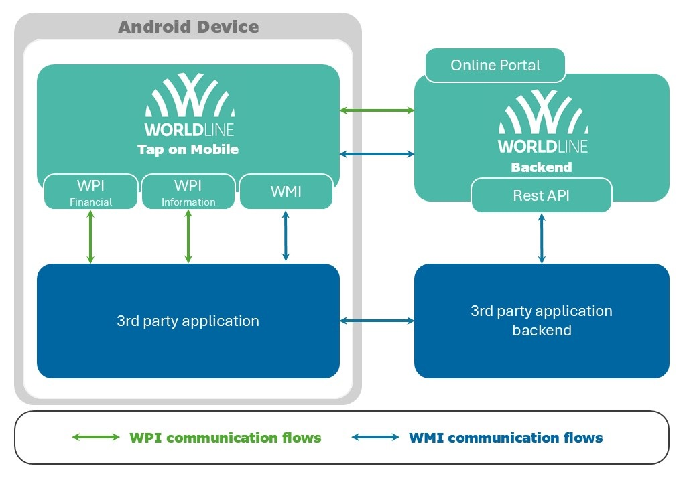

[BACK](../README.MD)
# Introduction
This documentation is intended for third-party application providers who wish to develop business applications interacting with Worldline Tap on Mobile application to provide contactless card payment functionality and covers the supplementary management processes which currently are built around the integrated registration functions.

High level architecture and interfaces view including Worldline Payment Interface and Tap on Mobile Management Interface flows is presented below.

To interact with a payment application, Tap on Mobile offers intent based interface for easy and fast integration. A 3rd party application is used to extend and control the business flow for the desired use cases. The payment application is displayed only in the event of a transaction.
Tap on Mobile is using Android Intents mechanism that allows to communicate between components of an Android app, such as Activities, Services, Broadcast Receivers, and Content Providers. An Intent object is used to describe what an app component should do, including the action to be performed and the data to be used.

Intent usage in Android for application integration can be broadly categorized into two types:

1.	Explicit Intents: These intents are used to launch a specific component within the same app. The target component is specified explicitly in the intent. For example, starting an Activity from another Activity within the same app.

2.	Implicit Intents: These intents do not specify the target component directly. Instead, they declare a general action to be performed and let Android resolve the target component based on the information provided in the intent. For example, sending an email or opening a web page. Softpos API is the implementation of this type of intent.

Intents can also carry data in the form of key-value pairs, called Extras, which can be used to pass data between components. By using intents, apps can delegate tasks to other components and take advantage of the existing Android framework to perform common actions.

More information about Intents can be found in native [Google Android documentation](https://developer.android.com/guide/components/intents-filters).

Tap on Mobile provides a set of intents that developers can use to build apps that work with the interface. The following intents are available:
- WPI Financial operations - offers the possibility of performing a financial operation: payment, reversal, refund, credit
- WPI Information operations – offers the ability to check the status of the last performed transaction
- WMI - provides a set of management functions necessary to register and unregister the application, as well as to check its current status

*Notice*: To fully utilize WPI's capabilities, backend-to-backend integration may also be required. This enables full remote management of the available terminals.

[NEXT](./1_1_Supported_perations.MD)