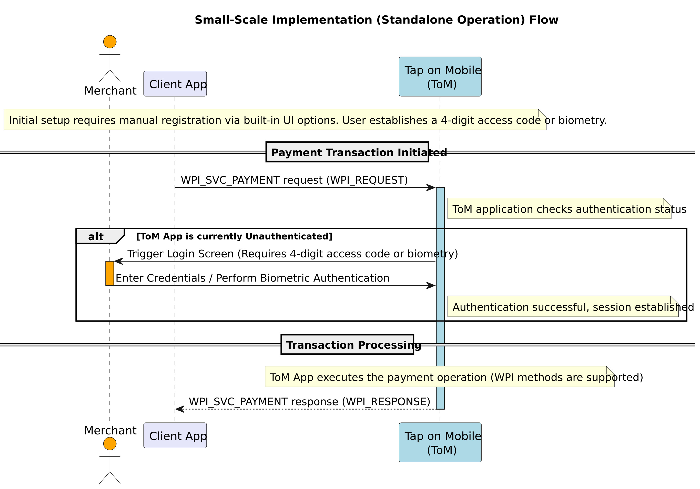
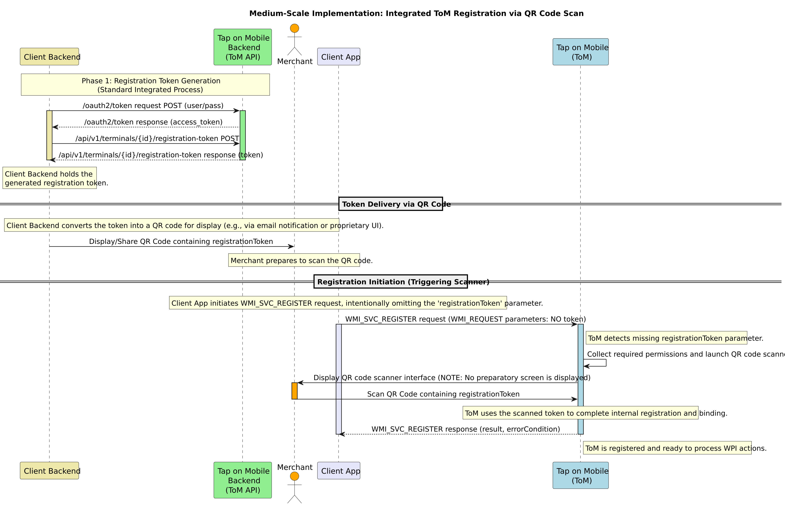
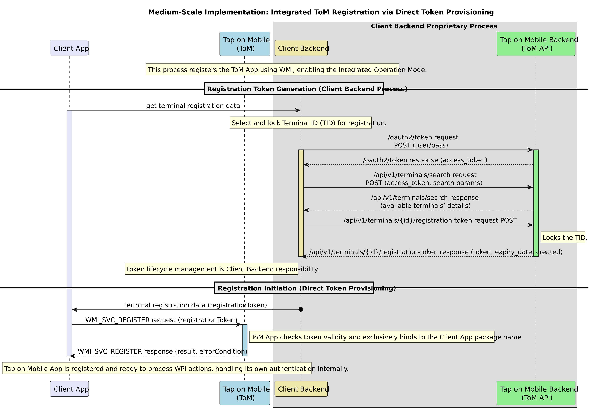
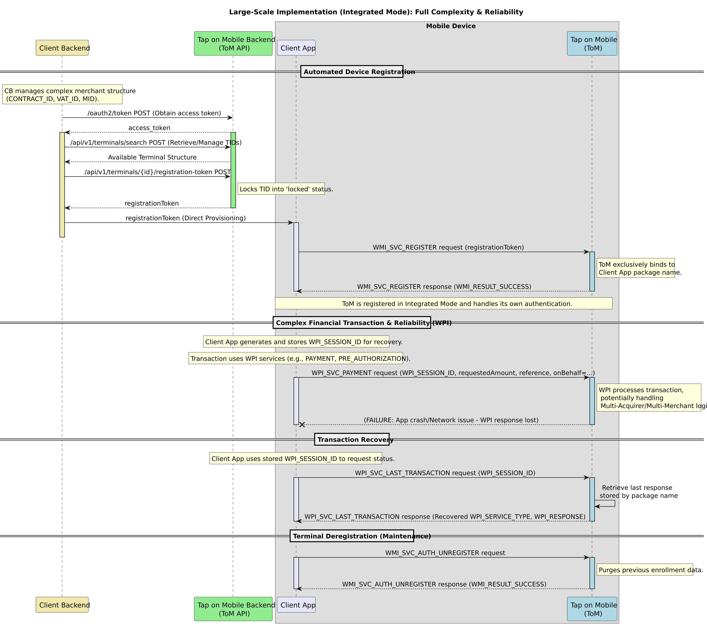

[BACK](./2_1_Tap_on_Mobile_operation_modes.md)

# 2.2 Implementation scaling

The following chapters describe core processes such as checking application status and the sequences required for registering and unregistering terminals via specific WMI service types.
Communication between the third-party application and Tap on Mobile is handled through Android Intents and structured JSON data payloads, including defined error conditions and response statuses.

Tap on Mobile (ToM) operates in two main modes: standalone and integrated. Based on operating modes and merchant hierarchical structures, we can divide implementation scalability into small, medium, and large implementations based on the complexity of the requirements.

## 2.2.1 Small-scale 
A small-scale implementation applies to individual terminals (TIDs) or simple MIDs, and utilizes the **Standalone operation mode**, which is characterized by **manual enrollment** and reliance on the user to handle authentication directly through the Tap on Mobile (ToM) application's built-in user interface.

A small-scale implementation can be devided into following phases: 

*   **Enrollment and Authentication:** Enrollment is performed manually by the user using **built-in UI registration options**. This mode requires establishing a 4-digit application access code, which is then required for authentication operations, or biometry options if supported by the product configuration.
*   **WPI Support:** Using standalone mode supports Worldline Payment Interface (WPI) methods. Any WPI function call to an unauthenticated ToM application will trigger a login screen (requiring the 4-digit access code or biometry).
 For Worldline in the Client App there is defined dynamic properties **api.intent.passcode** which, when set to TRUE, enables automatic login. It works as follows:
    *    When logging into the application for the first time, the access code is saved in the application itself.  
    *    When the intent is triggered, if the access code is already saved, the Client application logs in automatically, and the Merchant no longer needs to enter it.

*   **Integration:** This implementation requires little to no direct integration with the Tap on Mobile backend API, as management (registration/authentication) is handled internally by the ToM application's UI.

The diagram below illustrates the flow for initiating a transaction (WPI) in the Standalone operation mode, focusing on the critical **manual authentication step** required when the ToM application is unauthenticated.

## 2.2.2 Medium-scale 

A medium-scale implementation relies on the ToM integrated operation mode, and can be completed in two ways, using **QR Code Scanning** or **Direct Token Provisioning (Automated Scale)**.
 In both ways, to generate a registrationToken that will later be sent to the Client App, the Client Backend performs the same steps as Backend authentication and Terminal Locking.

**Backend Authentication**: 
 The Client Backend obtains an access_token from the Tap on Mobile (ToM) backend API using OAuth2 authentication.
  **Terminal Locking**: 
 The Client Backend retrieves the merchant's terminal structure (using */api/v1/terminals/search*) and selects a Terminal ID (TID) to register it, then calls the API function POST */api/v1/terminals/{id}/registration-token* to lock the TID and generate a unique registrationToken.

 Then, depending on the implementation method, the following steps are performed:
 
**Implementation Using QR Code Scanning**

1. The Backend needs to display this token, potentially encoded in a QR-code format, for the user to access. 
 (***Note***: The API function *POST /api/v1/terminals/{id}/registration-token* includes an optional email parameter to share the registrationToken in QR-code format via email, but this is an optional user notification and not the standard registration mechanism)
2. Registration Request (Missing Token): The Client App initiates the terminal registration sequence using WMI_SVC_REGISTER without providing the registrationToken parameter in the WMI_REQUEST.
3. ToM App Response: In this scenario, because the registrationToken parameter is not present, the Tap on Mobile (ToM) application will automatically launch a QR code scanner to collect the required permissions and scan the registrationToken.
4. Merchant Action: The Merchant then scans the QR code containing the token, allowing the ToM application to complete the registration process.
5. Tap on Mobile is registerd and ready to precess WPI actions.

&nbsp;&nbsp;&nbsp;&nbsp;The diagram below illustrates the flow Medius-scale implementation via QR Code scans. 

 
 
 
**Direct Token Provisioning** 

1. Token Delivery (Direct): The Client Backend transmits the generated registrationToken (which is a mandatory request parameter) to the Client App running on the device
2. Terminal Registration: The Client App initiates the enrollment sequence using the Worldline Management Interface (WMI) service WMI_SVC_REGISTER, passing the received registrationToken in the WMI_REQUEST parameters.

3. ToM App Response: In this scenario, because the registrationToken parameter is not present, the Tap on Mobile (ToM) application will automatically launch a QR code scanner to collect the required permissions and scan the registrationToken.
4. Merchant Action: The Merchant then scans the QR code containing the token, allowing the ToM application to complete the registration process.
5. Tap on Mobile is registerd and ready to precess WPI actions.

&nbsp;&nbsp;&nbsp;&nbsp;In this method terminal management is centralized in the backend, and registration is initiated programmatically via WMI.

&nbsp;&nbsp;&nbsp;&nbsp;The diagram below illustrates the flow Medius-scale implementation via QR Code scans

## 2.2.3 Large-scale 

Implementation for a large-scale deployment using the **Integrated Operation Mode** is achieved through detailed backend integration, primarily revolving around the **Integrated ToM registration process** and comprehensive usage of the **Worldline Payment Interface (WPI)**.

The integrated mode is mandatory for scaling, as it automates terminal management and bypasses the limitations of manual setup.

Large-scale implementation is achieved as follows:

**1. Backend Integration for Centralized Management**

Large-scale implementation necessitates direct integration between the 3rd party application backend and the Tap on Mobile (ToM) backend API. This integration covers the following mandatory areas:

*   **Authentication (OAuth2):** The backend must handle **OAuth2 authentication** to obtain access tokens. These tokens are required to authenticate and authorize requests to protected resources within the ToM API. Storing these credentials directly in the mobile application is not allowed.
*   **Terminal Structure Retrieval:** The backend must retrieve and manage the merchant’s complete terminal organization structure (including potentially hierarchical tiers like `CONTRACT_ID`, `VAT_ID`, and `MID`) using the function `POST /api/v1/terminals/search`. This allows the system to track potential changes and make decisions on which **Terminal ID (TID)** to assign during registration.
*   **Terminal Locking and Token Generation:** To ensure controlled deployment, the backend must **lock a free terminal** selected for registration by calling the API function `POST /api/v1/terminals/{id}/registration-token`. This action generates a unique `registrationToken` and moves the TID to a 'locked' status, ensuring the TID cannot be manually registered in standalone mode during the token's validity.

**2. Device Enrollment and Binding**

Once the backend generates the `registrationToken`, the Client App uses the Worldline Management Interface (WMI) to register the device:

*   **Token Delivery:** The Client Backend delivers the generated `registrationToken` to the Client App.
*   **WMI Registration:** The Client App initiates the terminal enrollment sequence using the service type **`WMI_SVC_REGISTER`**, passing the `registrationToken`.
*   **Exclusive Binding:** During this registration process, the ToM application performs a crucial security check: it **checks and exclusively binds** to the package name of the registering 3rd party application. This binding ensures that all Worldline Payment Interface (WPI) and most WMI requests originating from other applications on the same device are rejected.

**3. Operational Features Enabling Scale and Reliability**

The Integrated operation mode provides features essential for running a large, complex network of payment terminals:

*   **Autonomous Authentication:** After successful registration, the ToM application becomes solely responsible for its **own authentication and session validity**. The 3rd party application is thus relieved of managing user login or authentication functions for transactions.
*   **WPI Usage:** The 3rd party application interacts with the ToM app using **WPI function calls** (e.g., `WPI_SVC_PAYMENT`) to execute all financial and management use cases, ensuring compatibility across a wide range of devices and payment protocols.
*   **Reliability and Recovery:** For maximum reliability in a large network, the business application **must store the `WPI_SESSION_ID`** for every transaction request. If a transaction fails unexpectedly (e.g., due to an app crash or network error) and the result is unknown, the recovery feature **`WPI_SVC_LAST_TRANSACTION`** must be used to retrieve the outcome of the previous transaction from the payment solution.
*   **Device Unregistration:** Large-scale terminal lifecycle management requires a simple way to decommission devices. This is done programmatically using the WMI service type **`WMI_SVC_AUTH_UNREGISTER`**, which removes the currently assigned TID and purges all previous enrollment data, making the device available for re-registration.

The diagram below illustrates a Large-scale implementation. 

[NEXT](../3_Worldline_Payment_Interface/3_1_1_Interface_structure_and_activity_launch.MD)