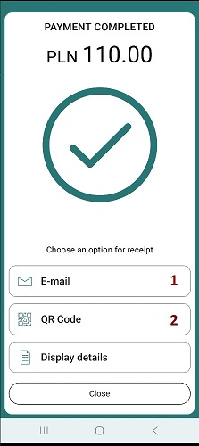

[BACK](./3_1_4_Reversal.MD)

#### 3.1.5.1 Receipt Format

Tap on Mobile provides three options for transaction confirmation.
1. A text-based confirmation returned in the intent response.
2. A complete set of data required to build the confirmation independently, provided as JSON returned in the intent response.
3. A confirmation displayed in Tap on Mobile before exiting the intent.

The type of notification depends on the `receiptFormat` parameter sent in the `WPI_REQUEST`.
The following combinations are possible:

- `json"receiptFormat": ["FORMATTED"]`
<br>A text-formatted confirmation is returned in the response; the confirmation is not displayed in Tap on Mobile.
<br>This is the default option, used when receiptFormat is not sent.<br><br>
- `"receiptFormat": ["JSON"]`
<br>A set of data for building the confirmation is returned in the response; the confirmation is not displayed in Tap on Mobile.<br><br>
- `"receiptFormat": ["JSON", "FORMATTED"]`
<br>Both a set of data for building the confirmation and a text-formatted confirmation are returned in the response; the confirmation is not displayed in Tap on Mobile.<br><br>
- `"receiptFormat": []`
<br>The confirmation is not displayed in Tap on Mobile and is not returned in the response.

##### A text-based confirmation returned
For `"receiptFormat": ["FORMATTED"]`, the following structure is included in the response.

```json
"receipt": {
        "formatted": {
            "client": "This is to confirm your transaction     \n registered at:                          \n ----------------------------------------\n APM TEST & Merchant                     \n APM street 1                            \n APM city 1234                           \n ----------------------------------------\n 05.12.2025 14:23:06                     \n VISA       **** **** **** 0013          \n Amount:                       PLN 110,00\n Tip Amount:                    PLN 12,10\n Total Amount:                 PLN 122,10\n Exchange rate:       PLN 1,00 - EUR 0,24\n DCC amount:                    EUR 29,30\n Markup incl.:                    21,00 %\n I have been offered a choice of         \n currencies and I accept the final       \n amount in transaction currency.         \n Currency conversion provided by         \n Worldline.                              \n Transaction details:                    \n Status:                          CLEARED\n Authorization code:           (00)000671\n ARQC:                   745CF00E167FA050\n AID:                      A0000000031010\n Contactless                             \n Card expiry date:                   2912\n Type:                               SALE\n POS ID:                         WLIN0006\n MID:                           102003271\n Reference:                   sprawdzMnie\n VISA\n ",
            "merchant": "This is to confirm your transaction     \n registered at:                          \n ----------------------------------------\n APM TEST & Merchant                     \n APM street 1                            \n APM city 1234                           \n ----------------------------------------\n 05.12.2025 14:23:06                     \n VISA       **** **** **** 0013          \n Amount:                       PLN 110,00\n Tip Amount:                    PLN 12,10\n Total Amount:                 PLN 122,10\n Exchange rate:       PLN 1,00 - EUR 0,24\n DCC amount:                    EUR 29,30\n Markup incl.:                    21,00 %\n I have been offered a choice of         \n currencies and I accept the final       \n amount in transaction currency.         \n Currency conversion provided by         \n Worldline.                              \n Transaction details:                    \n Status:                          CLEARED\n Authorization code:           (00)000671\n ARQC:                   745CF00E167FA050\n AID:                      A0000000031010\n Contactless                             \n Card expiry date:                   2912\n Type:                               SALE\n POS ID:                         WLIN0006\n MID:                           102003271\n Reference:                   sprawdzMnie\n VISA\n "
        }
}
```
In the `client` and `merchant` tags, the text confirmation intended respectively for the customer and the merchant is returned. The newline character `\n` is used to indicate line breaks in the text.

##### A complete set of data required to build the confirmation
For `"receiptFormat": ["FORMATTED"]`, the following structure is included in the response.

```json
"receipt": {
"json": {
            "acquirerIdentifier": "14008500000F",
            "additionalData": {
                "transactionType": "AUTH",
                "transactionStatus": "CLEARED",
                "applicationCryptogram": "745CF00E167FA050",
                "cid": "ARQC"
            },
            "amount": 12210,
            "applicationIdentifier": "A0000000031010",
            "authorizationCode": "00 000671",
            "brandName": "WPI_BRAND_NAME_VISA",
            "cardDataInput": "WPI_CARD_DATA_INPUT_PROXIMITY_ICC",
            "cardExpiration": "2912",
            "cardholderVerificationMethod": "WPI_CVM_PIN_ONLINE",
            "currency": "PLN",
            "dccInfo": {
                "dccAmount": 2930,
                "dccCurrency": "EUR",
                "dccDisclaimer": "I have been offered a choice of currencies and I accept the final amount in transaction currency. Currency conversion provided by Worldline.",
                "dccEcbIndicator": false,
                "dccExchangeRate": "0,24000",
                "dccMarkup": "21,00 %"
            },
            "duplicate": false,
            "legalIdentificationRequired": false,
            "maskedPan": "**** **** **** 0013",
            "operatorIdentifier": "102003271",
            "paymentSolutionReference": "ee002b63-09fe-4dcb-9681-5796607fd3c2",
            "receiptTargets": {
                "client": {
                    "description": "List of field names of the receipt to be included for the client receipt",
                    "items": [
                        "shopInfo",
                        "timestamp",
                        "brandName",
                        "maskedPan",
                        "currency",
                        "amount",
                        "tipAmount",
                        "dcc",
                        "transactionStatus",
                        "authorizationCode",
                        "applicationCryptogram",
                        "applicationIdentifier",
                        "transactionType",
                        "terminalIdentifier",
                        "operatorIdentifier",
                        "reference",
                        "cardExpiration"
                    ]
                },
                "merchant": {
                    "description": "List of field names of the receipt to be included for the merchant receipt",
                    "items": [
                        "shopInfo",
                        "timestamp",
                        "brandName",
                        "maskedPan",
                        "currency",
                        "amount",
                        "tipAmount",
                        "dcc",
                        "transactionStatus",
                        "authorizationCode",
                        "applicationCryptogram",
                        "applicationIdentifier",
                        "transactionType",
                        "terminalIdentifier",
                        "operatorIdentifier",
                        "reference",
                        "cardExpiration"
                    ]
                }
            },
            "reference": "sprawdzMnie",
            "shopInfo": {
                "address": "APM street 1, APM city 1234",
                "name": "APM TEST & Merchant"
            },
            "terminalIdentifier": "WLIN0006",
            "timestamp": "2025-12-05T14:23:06+01:00",
            "tipAmount": 1210
        }
}
```

##### A confirmation displayed in Tap on Mobile
For `"receiptFormat": []`, the transaction flow ends with the screen below.



The user has the option to either send the confirmation via email in PDF format (1) or display a QR code that allows downloading the PDF confirmation (2).

[NEXT](./3_1_5_2_Transactions_on_Behalf.md)