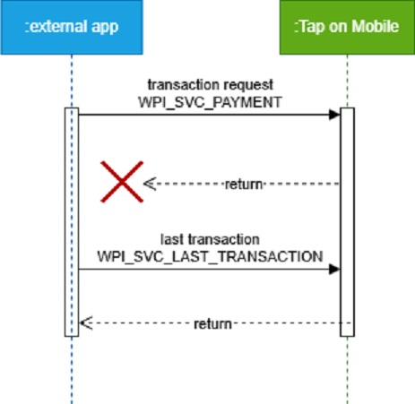

[BACK](./3_2_1_Interface_structure_and_activity_launch.MD)

### 3.2.2 Last transaction
In case of the last payment transaction response is not known any more it can be requested by this service. It will return the last financial transaction response independent of the result, failed or success. This is a recovery feature as the payment solution will remember the last SESSION_ID as well as corresponding transaction response. The Android Extras are close to a standard transaction response except for the conditional presence of WPI_SERVICE_TYPE & WPI_RESPONSE. An initial check on one of these extra properties can provide information about the existence of the session.

Be aware any payment solution will just store the last response. That implies that no other WPI request shall be done before the recovery. 

For more information about proper error handling see [3.3 Error codes and proper error handling](./3_3_Error_codes_and_proper_error_handling.md)
#### 3.2.2.1 WPI_REQUEST - list of supported input parameters
For `WPI_SVC_LAST_TRANSACTION`, an empty JSON must be sent in the `WPI_REQUEST`. The function does not expect any additional input parameters.

#### 3.2.2.2 WPI_RESPONSE - list of supported output parameters
The structure of WPI_RESPONSE depends on the previously invoked function — the WPI_RESPONSE contains the response from the previously called intent.

[NEXT](./3_3_Error_codes_and_proper_error_handling.md)