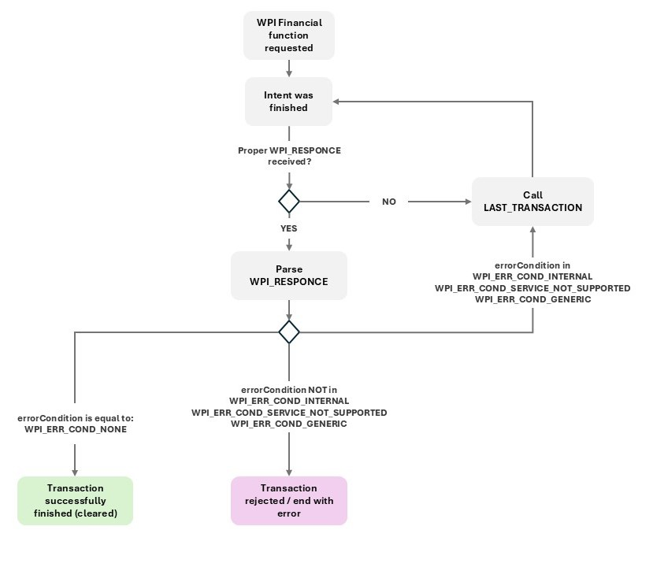

[BACK](./3_2_2_Last_transaction.MD)

## 3.3 Error codes and proper error handling
The list of potential errors that may be returned by WPI is presented in the table below.

|Error condition|Description|
|----------|-----------|
|WPI_ERR_COND_NONE|Transaction processed sucessfully without error.|
|WPI_ERR_COND_BUSY|Other intent request was during processing - in such situation both request (ongoing and new) will be finised. For ongoing error will be depend of curent status, for new request WPI_ERR_COND_BUSY wil be returned.|
|WPI_ERR_COND_CARD_READ_ERR|Card was refused durin reading (card is not supoorted or errors during card reading).|
|WPI_ERR_COND_GENERIC| NFC hardware not available/NFC hardware not available/ other technical error on device.|
|WPI_ERR_COND_HOST_REFUSAL|Transaction was refused by authorisation host or terminal is not properly registered and Tap on Mobile host refuse to proces transaction.|
|WPI_ERR_COND_INTERNAL|Application internal error\other unhandled errors.|
|WPI_ERR_COND_INVALID_AMOUNT|In request parameters entered invalid transaction amount, eg. 0.|
|WPI_ERR_COND_INVALID_CURRENCY|In request parameters entered invalid currency other then parametrised for terminal.|
|WPI_ERR_COND_INVALID_PASSWORD|Specific error — for this terminal, entering a PIN is required to perform a refund, and the user entered an incorrect PIN three times.|
|WPI_ERR_COND_INVALID_TRANSACTION_REQ|- Security errors during application start  - Checkout functionality specyfic errors - mising/wrong checkoutid  - refund or reversal of transaction was called but transaction does not exist, or can't be refunded/reversed.|
|WPI_ERR_COND_MISSING_MANDATORY_PARAMETER|One of thr mandatory parameter is missingi in `WPI_REQUEST`.|
|WPI_ERR_COND_NOT_INITIALIZED|The payment solution is not configured and cannot process the request.|
|WPI_ERR_COND_SERVICE_NOT_SUPPORTED|I/O errors, socket timeouts and other such technical problems.|
|WPI_ERR_COND_TIP_AMOUNT_EXCEEDS_MAXIMUM|Sended `tipAmount` is larger then limits definied for terminal.|
|WPI_ERR_COND_TIP_NOT_SUPPORTED_BY_PAYMENT_SOLUTION|Tipping not allowed for terminal but `tipAmount` parameter was send in `WPI_REQUEST`.|
|WPI_ERR_COND_TIP_NOT_SUPPORTED_BY_SERVICE_TYPE| `tipAmount` is not supported in this WPI functions (eg reversal does not support it)
|WPI_ERR_COND_TLP_NOT_FINALIZED|Estey and TLP specific error - The transaction can only be refunded to the same card.|
|WPI_ERR_COND_TRANSACTION_TIMEOUT|Timeout caused by the customer — the time expired for card reading, PIN entry, etc.
|WPI_ERR_COND_USER_CANCEL|Transaction cancelled by user before authorisation.|
|WPI_ERR_COND_WPI_VERSION_NOT_SUPPORTED|- Wrong, not suported version of WPI - Wrong ToM application version - Atestation error.|
|WPI_ERR_TLP_NOT_FINALIZED|Estey and TLP specific error - terminal is managed by TLP but activation not completed. At this moment, transaction can be performed on this terminal.|
|WPI_ERR_UPDATE_REQUIRED|- A newer version of the transaction is available and the user interrupted the intent call to download it.  - An application update is required, but the user refused the update.|

When handling errors, the following should be taken into account:
- In the event of a lost connection between the application and the backend during the transaction flow, there may be situations in which WPI returns an error, but the transaction is actually completed.
- The intent may return an empty response (for example, in the case of an application crash).

Therefore, for selected error types and in situations where an empty response is received, the `LAST_TRANSACTION` function should additionally be used to confirm the transaction result. The correct algorithm is shown in the diagram below.

[NEXT](../4_Worldline_Management_Interface/4_1_Interface_structure_and_activity_launch.MD)

