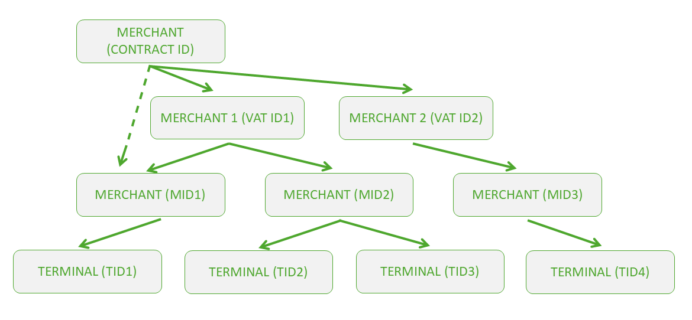

[BACK](./5_1_ToM_backend_API_OAuth2_authentication.md)

## 5.2 Retrieving and managing merchant’s terminal structure

Merchant applications access to ToM backend API should reflect the complete merchant organization structure. Organization structure uses up to three tier levels, i.e.:

**CONTRACT_ID** is optional and only used in case lower level tiers require aggregation;
**VAT_ID** is optional and only used in case lower level tiers require aggregation;
**MID** is the lowest and most common merchant organization structure tier; TIDs are allocated on a MID level.

Merchant structure is always assigned and edited by the acquiring entity. However, merchant’s 3rd party application backend should be capable of retrieving this structure from ToM backend, track the potential changes in it and be capable of deciding which TID should be assigned during the registration process.

ToM API documentation lists several merchant level functions that may be used for terminal management, however a suggested function for retrieving current merchant terminal structure is **POST /api/v1/terminals/search**.

### 5.2.1 Request Parameters

Complete list of function request elements is available in ToM API specification (https://sandbox-wl-emea.softpos.eu/swagger-ui/index.html?configUrl=/v3/api-docs/swagger-config#/Terminals/search_8). Tables below summarize most important parameters and function filters.

|Parameter|Description|Type|Condition|
|---------|-----------|----|---------|
|page|Integer defining a zero-based page index (default is 0)|Integer|Optional|
|size|Integer defining number of items to be returned in a single page (default is 10)|Integer|Optional|
|sort|String defining response list sorting criteria in the format: property,(asc\|desc). Default order is ascending. Multiple sort criteria are supported|String|Optional|

|Parameter|Description|Type|Condition|
|---------|-----------|----|---------|
|contract_id|Merchant tier level identifier or combination of identifiers defining which part of terminal structure should be returned|String|Optional|
|vat_id|Merchant tier level identifier or combination of identifiers defining which part of terminal structure should be returned|String|Optional|
|mid|Merchant tier level identifier or combination of identifiers defining which part of terminal structure should be returned|String|Optional|
|tid|Terminal identifier. Used when current terminal details need to be checked|String|Optional|
|connected|Terminal assignment status: true – terminal is linked to a device; false – terminal is unassigned and available|Boolean|Optional|
|disabled|Flag indicating whether the terminal is temporarily restricted from performing operations|Boolean|Optional|

### 5.2.2 Response Parameters

Complete list of response elements is available in ToM API specification (https://sandbox-wl-emea.softpos.eu/swagger-ui/index.html?configUrl=/v3/api-docs/swagger-config#/Terminals/search_8). Table below summarizes most important fields.

|Parameter|Description|Type|Condition|
|---------|-----------|----|---------|
|id|Terminal UUID stored in the ToM backend|String (UUID)|Mandatory|
|external_id|3rd party terminal identifier (if assigned and present)|String|Optional|
|tid|ToM backend recognized active TID selected for assignment|String|Mandatory|
|mid|ToM backend recognized MID corresponding to the selected TID|String|Mandatory|

[NEXT](./5_3_Locking_a_terminal_selected_for_registration.md)
