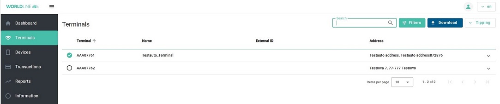
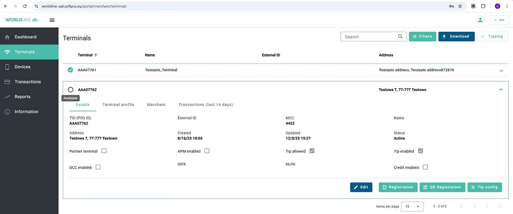
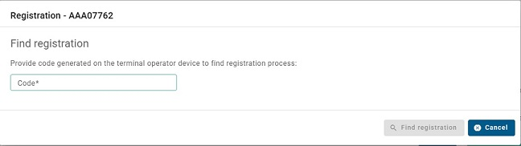
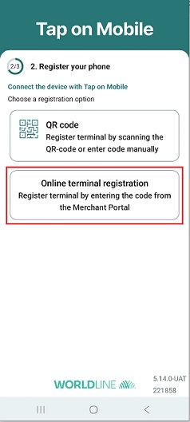
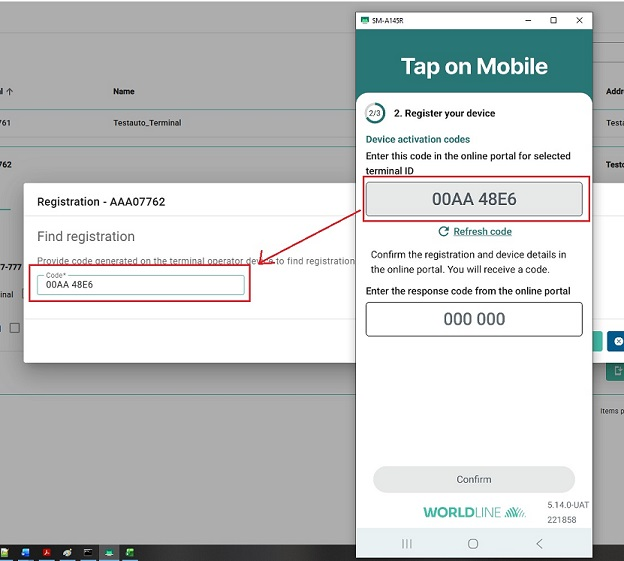
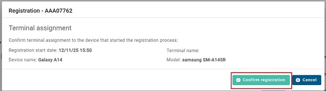
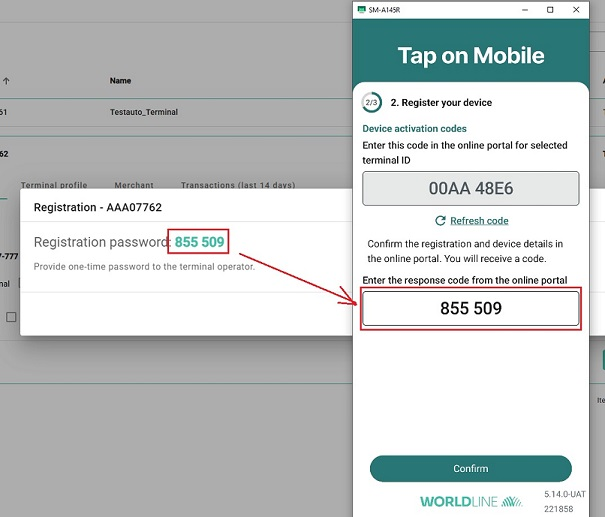
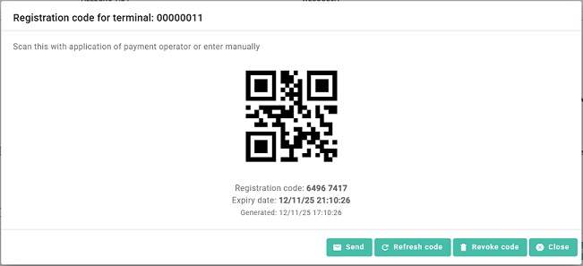

[BACK](../5_Tap_on_Mobile_backend_API/5_3_Locking_a_terminal_selected_for_registration.md)

# Appendix A - How to register application manually
For the terminal registration process, an interaction between the terminal operator and the online portal administrator is needed.

A detailed description of the app installation and registration process can be found in the document `Worldline_Tap_on_Mobile_user_manual`. The documentation should be shared with terminal operator in case he is involved in terminal registration / different from online portal administrator.

## Terminal registration process - based on codes

1. Login to the online Portal and click on the ‘Terminals’ section.   

2. Select a Terminal with status ‘Available’ on click the arrow button to expand the terminal view.    Press `Registration` button to start the terminal registration.   

3. In mobile app choose `Online terminal registration`   Then enter the code of the Worldline Tap on Mobile app  entered in the ‘Code’ field of the online Portal. Afterwards click Find registration   

4. Click `Confirm registration`    

5. The online Portal displays a verification code. Enter this code in the terminal app.  

6. Click the Close button in the online Portal at this stage. The terminal registration process in the online Portal is finished. 

7. Please finalize the registration on the terminal to get ready to accept payments. Please refer to `Worldline_Tap_on_Mobile_user_manual` if guidance is needed.

## Terminal registration process - based on qrcode

1. Login to the online Portal and click on the ‘Terminals’ section.   

2. Select a Terminal with status ‘Available’ on click the arrow button to expand the terminal view.    Press `QR Registration` button to start the terminal registration.   

3. In mobile app choose `QR code`   Then scan QR Code.  

4. Click the Close button in the online Portal at this stage. The terminal registration process in the online Portal is finished. 

5. Please finalize the registration on the terminal to get ready to accept payments. Please refer to `Worldline_Tap_on_Mobile_user_manual` if guidance is needed.

[NEXT](../Appendix_B_Transaction_Statuses/B_Transaction_Statuses.md)