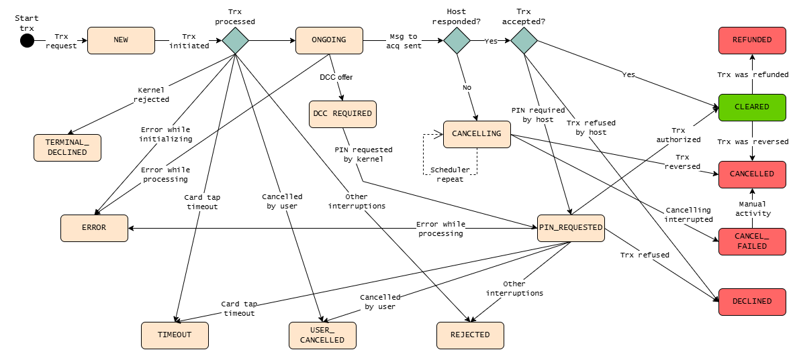
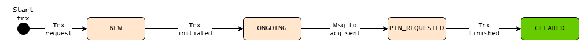
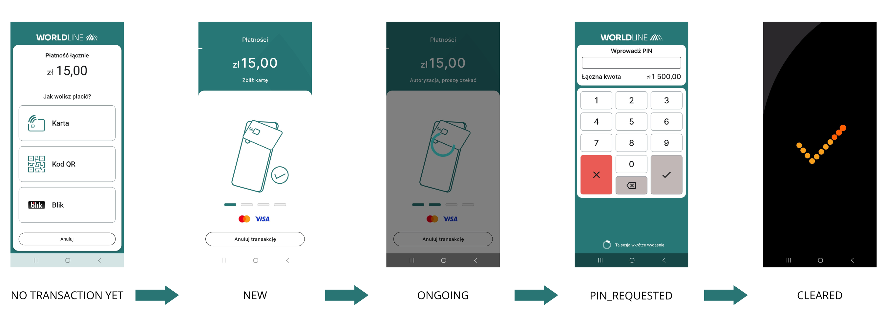
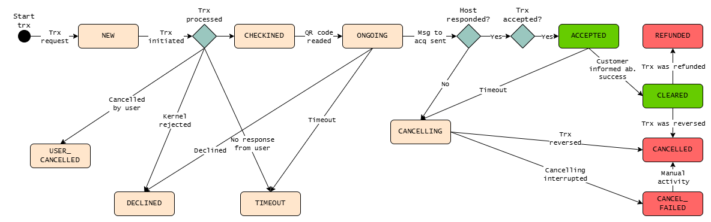
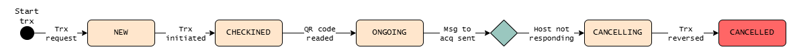
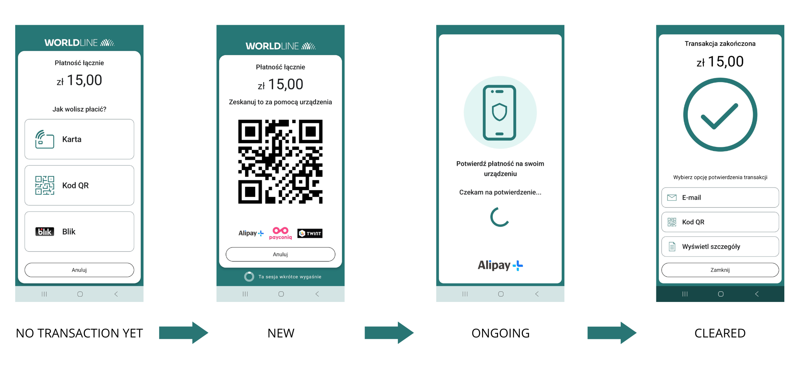
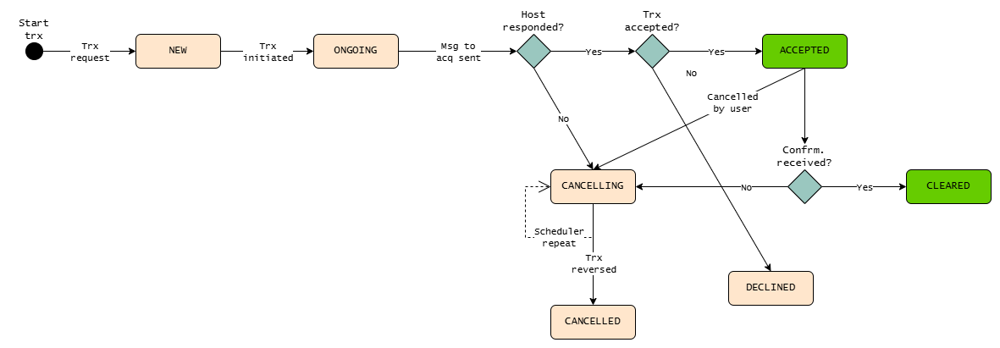
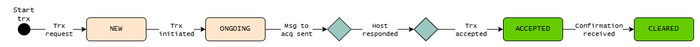
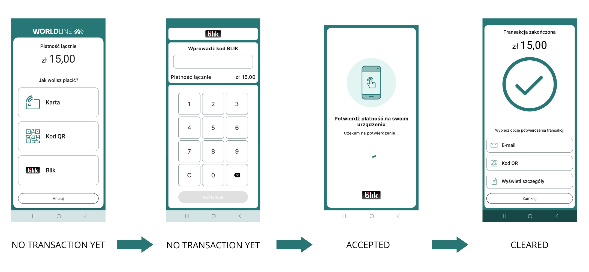

[BACK](../Appendix_A_How_to_register_application_manually/A_How_to_register_application_manually.md)

# Appendix B - Transaction Statuses

## 1. List of all possible transaction statuses.

|Status|Description|Integrator|Card|APM|Blik|
|----------|-----------|-----------|-----------|-----------|-----------|
|NEW|Newly created payment.|Initial status. If a transaction has this status after the intent is completed (payment/refund), it will not be completed successfully. It will be automatically canceled after no more than several minutes.|X|X|X|
|TIMEOUT|Transaction expired – timout on mobile app.|Transitional status. If a transaction has this status after the intent is completed (payment/refund), it will not be completed successfully. It will be automatically canceled after no more than several minutes.|X|X||
|DECLINED|Checkin declined by SATA or customer.|Final status. The transaction was rejected by the authorization host.|X|X|X|
|TERMINAL_DECLINED|Declined by kernel.|Final status. Payment card read error.|X|||
|CHECKINED|Checkin completed successfully.|Transitional status. If a transaction has this status after the intent is completed (payment/refund), it will not be completed successfully. It will be automatically canceled after no more than several minutes.||X||
|USER_CANCELLED|Transaction cancelled by the merchant or customer.|Final status. Transaction cancelled by user.|X|X||
|ONGOING|Authorization has been started, waiting for confirmation on customer mobile app.|Transitional status. If a transaction has this status after the intent is completed (payment/refund), it will not be completed successfully. It will be automatically canceled after no more than several minutes.|X|X|X|
|PIN_REQUESTED|PIN requested by kernel.|Transitional status. If a transaction has this status after the intent is completed (payment/refund), it will not be completed successfully. It will be automatically canceled after no more than several minutes.|X|||
|ACCEPTED|Payment accepted by the host, the status will change to CLEARED once the customer has been informed of the success of the transaction in the application. In all other cases, the status will be changed to CANCELLING.|Transitional status. If a transaction has this status after the intent is completed (payment/refund), it will not be completed successfully. It will be automatically canceled after no more than several minutes.||X|X|
|CANCELLING|Transaction cancelled unsuccessfully, Scheduler is working in a loop. This status can be treated as CANCELLED.|Final status. The transaction should be treated as canceled.|X|X|X|
|CLEARED|Payment completed.|Final status. Transaction successfuly authorised.|X|X|X|
|CANCELLED|Previously authorized transaction reversed/cancelled by CANCEL_TRANSACTION due to various errors or unfinished transactions.|Final status. The transaction was canceled.|X|X|X|
|CANCEL_FAILED|Transction not cancelled due to various errors or when number of Scheduler retries reaches retry limit. This status can be treated as CANCELLED.|Final status. The transaction should be treated as canceled.|X|X||
|REJECTED|Other interruptions.|Final status. The transaction ended with an error.|X|||
|REFUNDED|Transaction refunded.|Final status. The transaction was refunded.|X|X||
|AUTHORIZED|Transaction authorized.|Final status. Transaction successfuly authorised.|X|||
|ERROR|Transaction processing failed.|Final status. The transaction ended with an error.|X|||
|DCC_REQUIRED|Customer is asked to accept/reject a DCC offer.|Transitional status. If a transaction has this status after the intent is completed (payment/refund), it will not be completed successfully. It will be automatically canceled after no more than several minutes.|X|||

## 2. Card payments

#### 2a. Transition matrix presenting the flow of the statuses while the card transactions are processed. This diagram shows all the possible transaction types and statuses.

#### 2b. Excerpt of above diagram, presenting the flow of the statuses while the card sell transaction is processed.

#### 2c. Statuses flow for Card payment basing on application interface.

## 3. APM payments

#### 3a. Transition matrix presenting the flow of the statuses while the APM transactions are processed. This diagram shows all the possible transaction types and statuses.

#### 3b. Excerpt of above diagram presenting the flow of the statuses of failed APM transaction, caused by inactive host.

#### 3c. Statuses flow for APM payment basing on application interface.

## 4. BLIK payments

#### 4a. Transition matrix presenting the flow of the statuses while the Blik transactions are processed. This diagram shows all the possible transaction types and statuses.

#### 4b. Excerpt of above diagram presenting the flow of the statuses while the Blik sell transaction is processed.

#### 4c. Statuses flow for BLIK payment basing on application interface.

[NEXT](../Appendix_C_Dictionaries/C_1_brandName.md)

